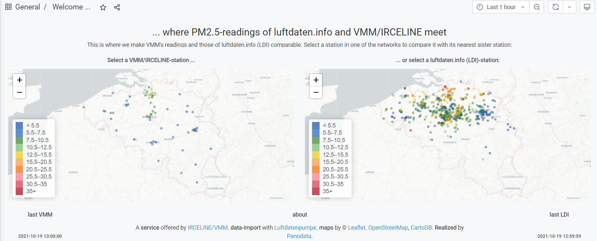
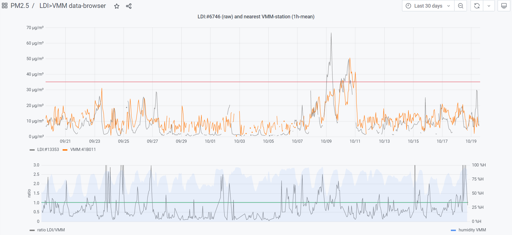
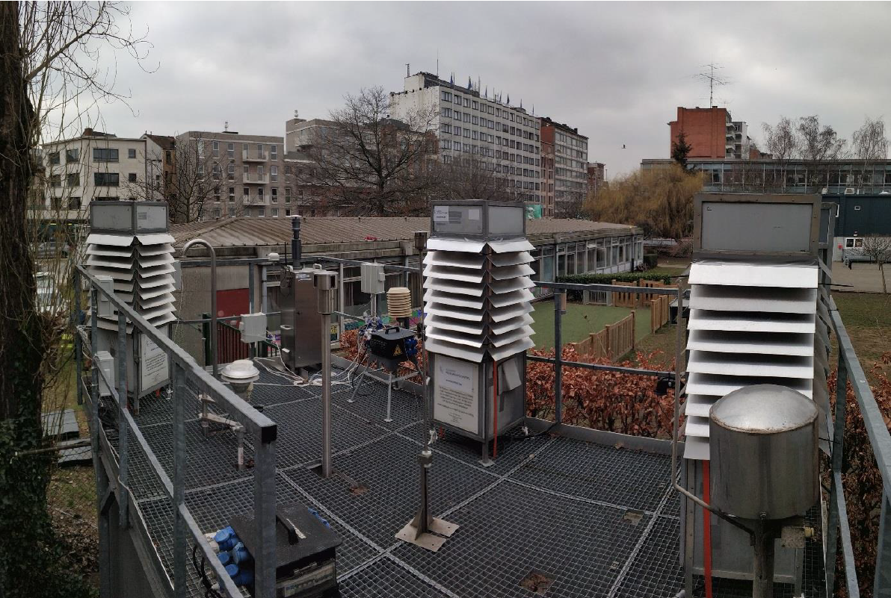

# Introduction

On this page you will find the following different results and outputs from the [Life VAQUUMS](https://vaquums.eu) project for low-cost air quality sensors:
* the [firmware](#esp8266-firmware) used to program the ESP8266 to prepare and send low-cost PM sensor data to our internal Influx database over local WiFi
* an [interactive viewer](#interactive-viewer) to analyse and compare Luftdaten/Sensor.Community PM-measurements to official ones in Belgium
* the [complete dataset](#field-campaign-dataset) of the VAQUUMS field campaign with all the low-cost sensor and official Flanders Environment Agency (VMM) measurements for PM, NOx and O3 spanning over 1 year of data

# ESP8266 firmware

Nearly all of the low-cost sensors were coupled to an Arduino which was interfaced to an ESP8266 module. The ESP8266 took care of storing the data over WiFi to a local network running an Influx database.

The firmware for the ESP8266 was written in VSCode using the PlatformIO extension. You can find the latest version of the firmware source code [here](/esp8266_firmware/).

For controlling the Alphasense OPC-N2 sensor we used the [C library](https://github.com/dhhagan/opcn2) developed by David H Hagan.

# Interactive viewer

A demonstration video showing the different features of the interactive viewer can be found [here](https://vaquums.eu/news/a-tour-of-our-outcomes-visualising-sensor-data).





This viewer was developed by [Panodata](https://github.com/panodata) in Grafana and uses their [Luftdatenpumpe](https://github.com/earthobservations/luftdatenpumpe) as workhorse to retrieve Luftdaten/Sensor.Community data over the API and combine it with official air quality measurements from the Belgian endpoint hosted by [IRCEL](https://github.com/irceline/open_data).

You can try the viewer it out yourself by visiting this [link](https://ldp.irceline.be) and supplying the following credentials to log in:

```console
 username: vaquums
 password: vaquum$!
 ```

# Field campaign dataset

The field campaign of the low-cost sensors was organised at the official Flanders Environment Agency (VMM) monitoring station R801 in Borgerhout, Antwerp, Belgium (WGS84 coordinates: `51.2097 lat`, `4.4318 lon`). All of the low-cost sensors were placed in different shelters on the rooftop the monitoring station.

<br>

The following 19 sensors were tested in fivefold during a period of over one whole year from the `23rd of February 2019` until the `31st of March 2020`.

| Sensormodel         | Pollutant  |
|---------------------|------------|
| Nova Fitness SDS011 | PM         |
| Shinyei PPD42NJ     | PM         |
| Shinyei PPD60PV-T2  | PM         |
| Honeywell HPMA115S0 | PM         |
| Plantower PMS7003   | PM         |
| Winsen ZH03B        | PM         |
| Alphasense OX-B431  | O3+NOx     |
| Alphasense NO2-B43F | NO2        |
| Citytech NO2 3E50   | NO2        |
| Citytech O3 3E1F    | O3         |
| Membrapor NO2-C1    | NO2        |
| Membrapor NO2-C20   | NO2        |
| Membrapor O3-C5     | O3         |
| Dylos DC1700        | PM         |
| Aeroqual O3 0-0.15  | O3         |
| Envea CairClip NO2  | NO2, RH, T |
| Envea CairClip O3   | O3, RH, T  |
| Alphasense OPC-N2   | PM         |
| BME280 DHT sensor   | RH,T       |

And the official measurements of the Flanders Environment Agency ([VMM](https://www.vmm.be)) used the following equipment:

| Instrument              | Pollutant |
|-------------------------|-----------|
| Thermo Scientific 42i   | NOx       |
| API T400                | O3        |
| Palas Fidas 200         | PM        |
| Palas Fidas 200         | RH, T     |

You can access the entire dataset along with additional information [here](data/readme.md).

# Contact

If you have any questions or suggestions feel free to send us an [e-mail](mailto:vaquums@vmm.be)!